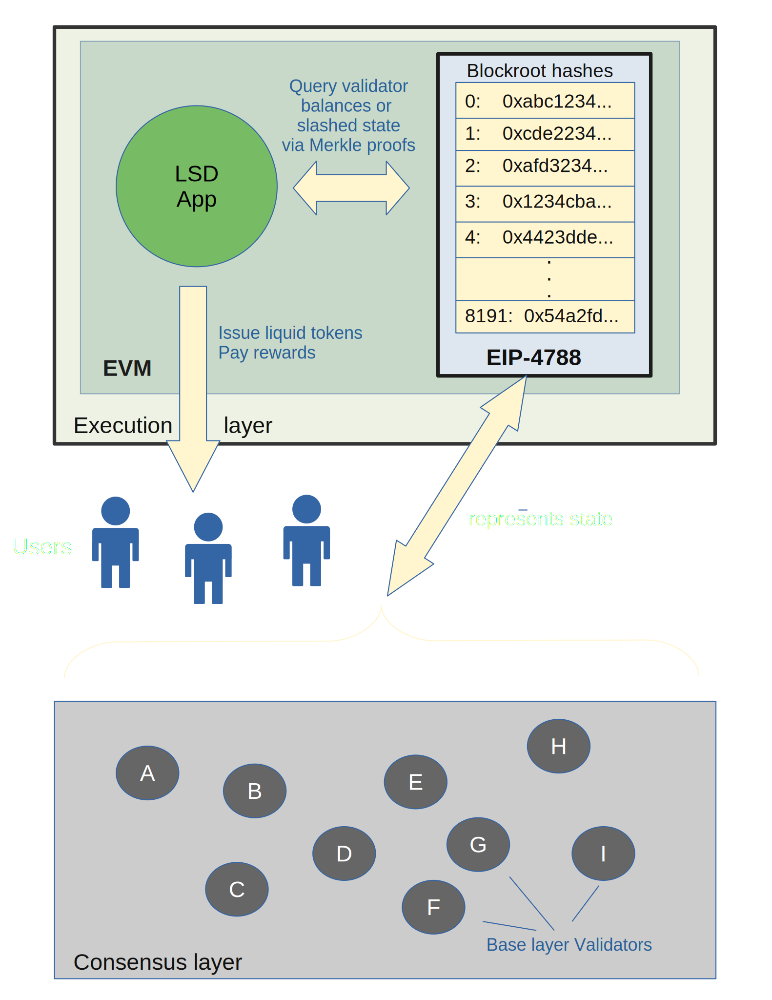

# Liquid Staking

## What is liquid Staking

### Proof-of-Stake
Proof-of-Stake protocols require users to stake assets (usually their native token) to secure the network.
This staking allows the staker to participate in block production on such PoS blockchains.
The more stake there is in a network, the more resources and assets does a potential attacker
require to threaten the network.

Because the staker has to commit a (usually considerable) sum in token assets for staking,
the staker is incentivized to operate virtuously in the interest of the network.
The token commitment results in **locking up** these assets for a duration of time.
As a compensation for contributing to the smooth functioning of the network 
and processing transactions, stakers commonly are awarded rewards.

Some protocols also contain slashing options, where the staked assets can be slashed,
or withhold, from the staker if the network determines they operated maliciously or 
under the required uptime conditions.

### Free the tokens!
For the duration of the staking period, the tokens are locked, which means, they can not be traded.
That's where Liquid Staking comes in.

Liquid Staking providers essentially stake the user tokens on their behalf (usually for a fee),
and issue their own new tokens as a counterpart. These new tokens now do not have any restriction,
and can be used to participate in other DeFi trading and operations.

## LSD
Liquid Staking Derivatives is an umbrella term to characterize the array of DeFi activities
which can be done with liquid tokens.

LSD do offer new areas for economic performance by leveraging the underlying assets to yield
additional gains by putting the liquid tokens to work in other financial operations.

Naturally, such designs come with their own risks.

To mitigate such risks, cryptographic primitives can be put in place.

## Main risks for LSD
As we said earlier, LSD protocols rely on underlying staked assets.
Like for example, a LSD protocol wanting to leverage Ethereum staking,
relies on ETH staked on the Ethereum network. 
Therefore the value of those LSD tokens is linked to the balances of the staked ETH.

On a fundamental level, staking happens on blockchain nodes. Tokens are staked with 
nodes, which become validators for the network. These validators participate in 
consensus, by producing blocks or attesting to the validity of blocks produced by other validators.

Now, the Ethereum protocol adopts the *slashing* primitive. Slashing occurs when
a node operates maliciously, dishonestly, or does not fulfill defined operation requirements 
(typically, cannot guarantee availability due to instability). In this case,
the Ethereum protocol will *slash* the affected node - which means, it will
be punished by having a portion of their stake destroyed.

This obviously directly affects LSD protocols which rely on the underlying staked assets.
If the underying validator's balance changed, for example due to slashing,
then the LSD protocol needs to know this.

There are also fraud protection scenarios, where malicious actors could be operating 
on fictitious validator balances. Issuing proofs of the correct balances offers
trust in the veracity of the underlying balances and slashing status.

## Oracles
Now, staking is a function of the *consensus* layer in Ethereum. As per ETH2,
consensus and execution is separated. 

The consensus layer is concerned with the tracking of validators, 
the staking transactions, and maintaining consensus of the state of the validators.

The execution layer is where projects building on top of Ethereum usually operate.
That's where the smart contracts are deployed.

Now, as we have seen, a LSD protocol requires assurance about the underlying balances
and slashing conditions of the validators. But the LSD contracts run on the execution layer.

How can it know these balances? Before EIP-4788, it required external oracles to 
rely on for this information. Which brings its own set of risks, for example
    * centralization
    * risk of collusion

## EIP-4788
This EIP-4788, which is a precompiled contract available in the execution layer,
provides cryptographic information about the state of the consensus layer inside the execution layer.
This now changes the game, as protocols like LSD do not need to rely on external information providers
to assert the state of validators. 

The EIP just provides the root hashes of consensus block headers. It maintains them in a ring buffer,
which means it has limited historical data available (a bit more than a day). 

In order for projects to take advantage of this feature, they need to apply cryptographic checks
against this root hashes. These root hashes are MerkleTrees, which allow to verify the integrity of a 
complete tree of data with only a subset of the data. 

In order for a LSD protocol to confirm a validator has not been slashed (for example before rewarding
participants of their protocol), they construct a MerkleProof of the validators they are interested in.
This requires building the tree of the state, calculating the root hash and then comparing that root hash 
in their smart contract with the one obtained from the EIP-4788 contract.

If they match, they know data of the validators they have at disposal is correct, and can proceed
with the intended operation (e.g. payout).

Such checks should also be applied at the beginning of the liquid staking commitment, 
to prove that at the time of creating the obligation, the validators had the expected balances
and slashing status.

